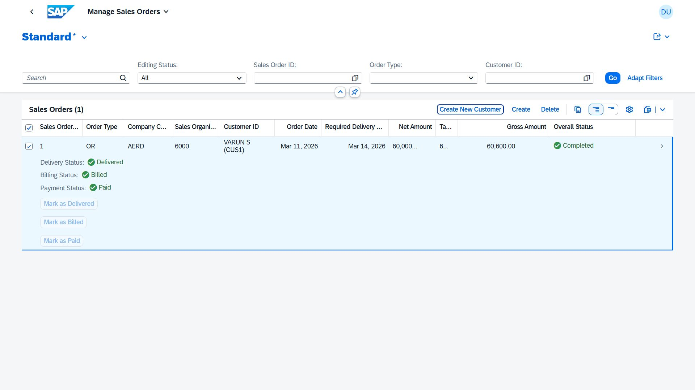
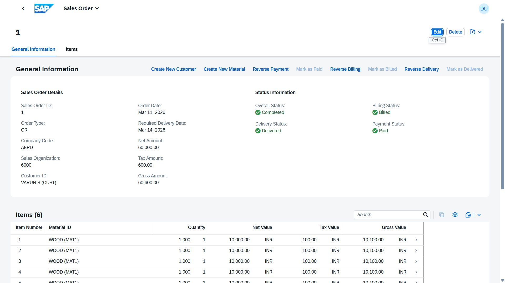

# Sales Order Management - SAP RAP on SAP BTP

A full-stack enterprise Sales Order application built using the **SAP RESTful Application Programming (RAP)** model on **SAP Business Technology Platform (BTP)**, simulating a real-world B2B order lifecycle from creation to payment.

---

## Application Screenshots

### Sales Order List Report


### Sales Order Object Page


---

## Architecture Overview

The application is designed around a modular enterprise business flow:

```
Sales Order ──► Delivery ──► Invoice ──► Payment
```

Each module is designed as an independent Fiori tile/application, connected through the **SAP Fiori Launchpad** to represent a complete end-to-end business process.

---

## Features

### Sales Order List Report
- Overview of all sales orders with status indicators
- Search and filter capabilities
- Tracking columns for Delivery, Billing, and Payment status
- Order management actions (Create, Edit, Delete)

### Sales Order Object Page
- Detailed view of individual sales orders
- Item-level line detail management
- Inline actions for Delivery, Billing, and Payment processing
- Full order lifecycle tracking

---

## Technology Stack

| Layer | Technology |
|---|---|
| Backend Framework | SAP RAP (RESTful Application Programming Model) |
| Platform | SAP Business Technology Platform (BTP) |
| IDE | SAP Business Application Studio (BAS) |
| UI Framework | SAP Fiori Elements (List Report + Object Page) |
| OData Version | OData V4 |
| Service Exposure | RAP Service Binding (UI + API) |

---

## Current Implementation Approach

> **Note:** Full Fiori Launchpad tile configuration requires elevated BTP permissions not currently available in the trial environment. As a workaround, a **single preview service** acts as the unified entry point, simulating cross-module navigation.

This approach demonstrates:
- How individual RAP services can be previewed and tested in BAS
- How OData services are exposed and consumed via service bindings
- How future multi-app navigation across modules can be structured

---

## Key Concepts Explored

- **OData Service Exposure** — Defining and publishing RAP services as OData V4 endpoints
- **Service Bindings** — UI vs. API bindings and their use in BAS preview mode
- **External Service Integration** — Connecting external service instances post-deployment
- **Multi-Module Architecture** — Designing loosely coupled modules that mirror enterprise SAP application patterns
- **Fiori Elements** — Leveraging annotations to generate List Report and Object Page UIs with minimal custom code

---

## Roadmap

- [x] Sales Order List Report (Fiori Elements)
- [x] Sales Order Object Page with item details
- [x] RAP service binding and OData V4 exposure
- [ ] Delivery module integration
- [ ] Invoice module with billing actions
- [ ] Payment module with status lifecycle
- [ ] Full Fiori Launchpad tile configuration
- [ ] Cross-module navigation with intent-based routing

---

## 💡 Learning Outcomes

This project provided hands-on experience with how enterprise SAP applications are **structured**, **exposed**, and **integrated** across services — bridging the gap between ABAP development and cloud-native SAP BTP architecture.

---

## 👤 Author

**Blesswin SJ**
